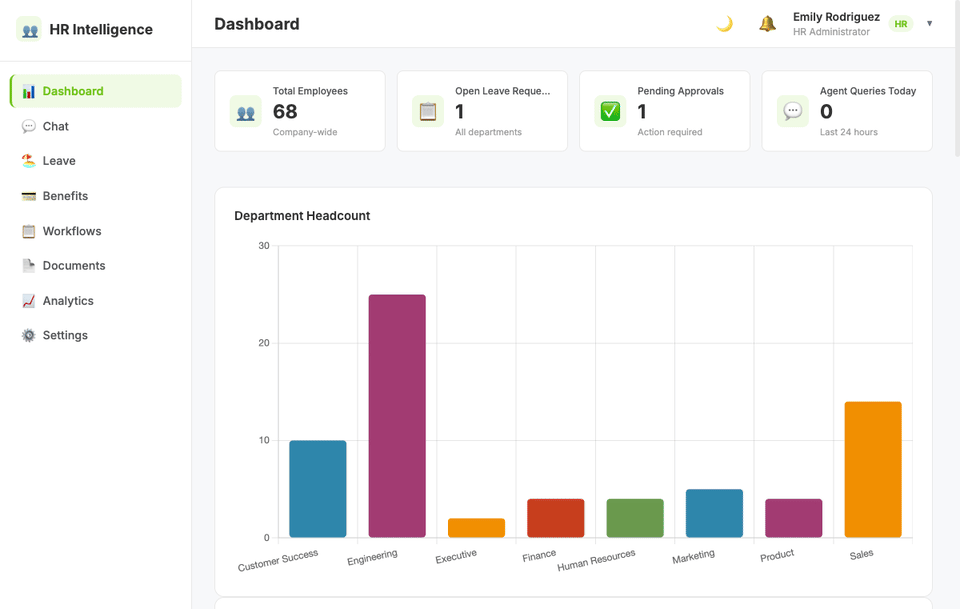
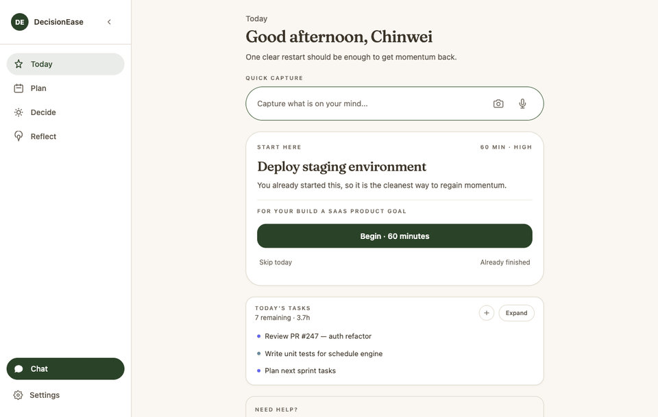
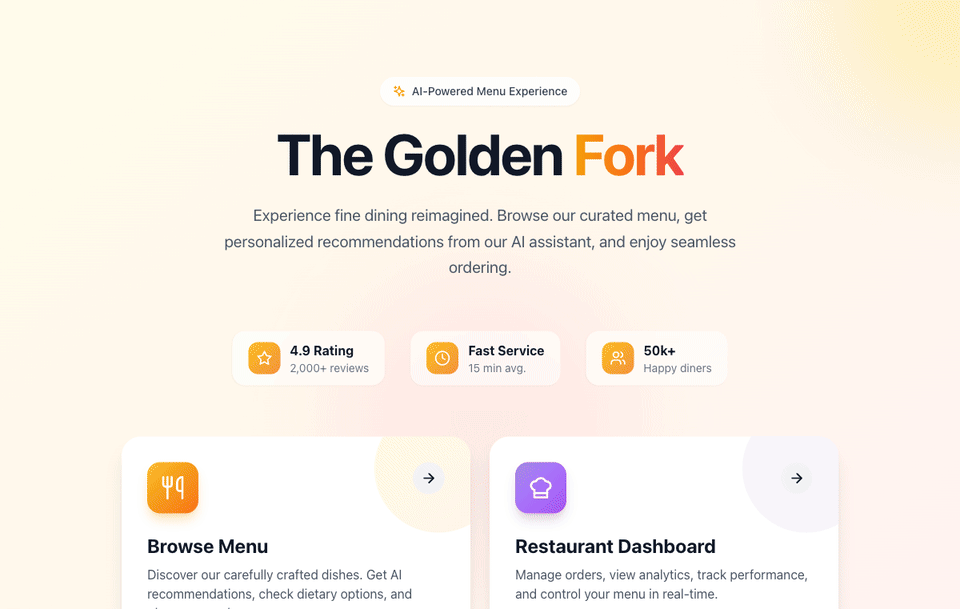

# Hi, I'm Aiden (Chin Wei) Mak 👋

### Applied AI Engineer · Multi-Agent Systems · RAG · Production-Grade LLM Products

I build production-grade LLM products end to end — multi-agent orchestration (LangGraph), retrieval-augmented generation, and MCP tool integration. I own these projects from architecture through deployment, orchestrating AI agents as part of my engineering workflow to ship fast without cutting corners on tests or reliability.

---

## 🚀 Featured Projects

### HR Intelligence Platform
> 8 LangGraph agents coordinating HR workflows over an MCP layer (28 tools) with RAG-backed retrieval, deployed on GCP Cloud Run.

- **Highlights:** 8 LangGraph agents · MCP (28 tools) · RAG · 1,909 tests · GCP Cloud Run
- **Live:** https://hr-platform-1054475963653.us-central1.run.app
- **Repo:** https://github.com/aidenmak0624/HR_agent

<!-- maintainer: add demo gif at ./hr-intelligence-platform.gif -->

---

### DecisionEase
> A 6-agent decision-support PWA with a 4-layer memory system (pgvector) and MCP tooling for structured, context-aware recommendations.

- **Highlights:** 6-agent decision support · 4-layer memory (pgvector) · MCP · 1,600+ tests · PWA
- **Live:** https://decisionease.vercel.app
- **Landing:** https://decision-ease-landing.vercel.app
- **Repo:** https://github.com/aidenmak0624/DecisionEase-landing

<!-- maintainer: add demo gif at ./decisionease.gif -->

---

### The Golden Fork
> A full-stack AI restaurant platform with Pinecone-backed RAG, real-time WebSocket interactions, and Stripe payments.

- **Highlights:** Pinecone RAG · real-time WebSocket · Stripe · full-stack
- **Live:** https://golden-fork-9tn2.onrender.com
- **Repo:** https://github.com/aidenmak0624/golden-fork

<!-- maintainer: add demo gif at ./the-golden-fork.gif -->

---

## 🛠 Tech

| Area | Tools |
|------|-------|
| **AI / Agents** | Multi-Agent Systems · LangGraph · LangChain · MCP · RAG · Tool/Function Calling |
| **Languages** | Python · TypeScript · JavaScript · SQL |
| **Backend** | FastAPI · Flask · Node.js |
| **Data / Vector** | PostgreSQL/pgvector · Redis · Pinecone · ChromaDB |
| **DevOps** | Docker · GCP Cloud Run · CI/CD · Pytest · Playwright |

---

## 📫 Contact

Toronto, ON · [aidenmak.vercel.app](https://aidenmak.vercel.app) · [linkedin.com/in/mcwaiden](https://linkedin.com/in/mcwaiden) · mcwaiden000@gmail.com
