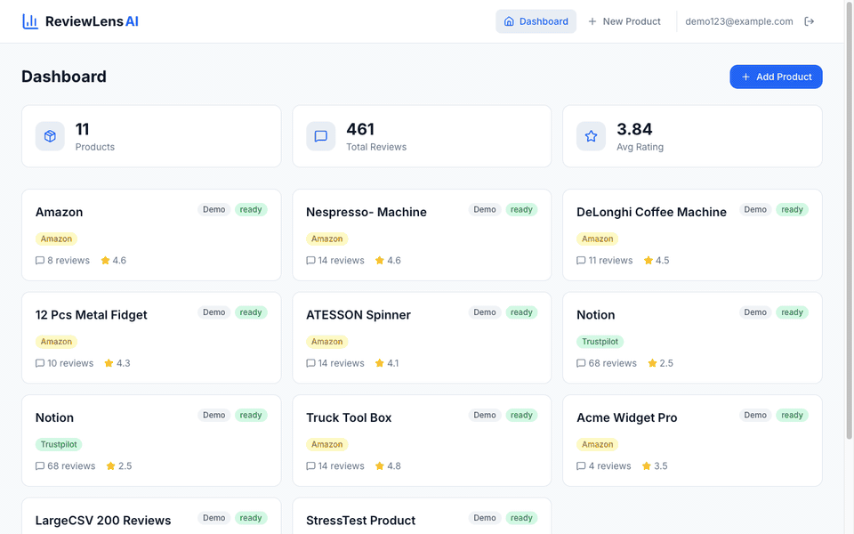

# Hi, I'm Aiden (Chin Wei) Mak 👋

### Software Engineer — AI Quality & Evals · Agentic Systems · RAG

Anyone can demo AI. I ship it to production — and prove it works. I build agentic AI products (LangGraph, RAG, MCP), then make them trustworthy with eval harnesses, thousands of automated tests, and production tracing. Every claim below links to a receipt.

🌐 **Portfolio & case studies: [aidenmak.com](https://aidenmak.com)**

---

## 🚀 Featured Projects

### HR Intelligence Platform
> 8 LangGraph agents coordinating HR workflows over an MCP layer (28 tools, 8 resources, 5 prompts) with RAG-backed retrieval, deployed on GCP Cloud Run.

- **Proof:** 1,909 unit / integration / workflow tests · 90%+ coverage · Prometheus / Grafana / LangSmith observability
- **Live:** https://hr-platform-1054475963653.us-central1.run.app/dashboard
- **Repo:** https://github.com/aidenmak0624/HR-Intelligence-platform · **Case study:** https://aidenmak.com/hr-intelligence.html

---

### ReviewLens AI
> Review-analytics SaaS where every answer cites the exact reviews behind it — citation-grounded RAG over Pinecone, GPT-4o, Supabase Edge Functions.

- **Proof:** 6/6 promptfoo LLM evals against the live pipeline · 168/173 Vitest passing, the 5 failures documented — not hidden
- **Live:** https://review-lens-ai-five.vercel.app
- **Repo:** https://github.com/aidenmak0624/ReviewLensAI · **How the evals work:** https://aidenmak.com/finding-llm-judge-evals.html

---

### DecisionEase
> A 6-agent decision-support PWA (orchestrator + 5 specialists) with a 4-layer memory system and agent-to-agent coordination — a decision coach that remembers who you are.

- **Proof:** 1,600+ automated tests across the FastAPI backend and Playwright suites
- **Live:** https://decisionease.vercel.app · **Landing:** https://decisionease.pages.dev/our-stories
- **Case study:** https://aidenmak.com/decisionease.html *(repo private — code available on request)*

---

### The Golden Fork
> Full-stack AI restaurant platform: RAG menu assistant on OpenAI embeddings + Pinecone, real-time WebSocket orders, Stripe payments.

- **Live:** https://golden-fork-9tn2.onrender.com *(free tier — allow ~30s cold start)*
- **Repo:** https://github.com/aidenmak0624/golden-fork

---

## ✍️ Findings

Short essays on AI quality, evaluation, and product judgment — with receipts:

- [Most of my RAG evals didn't need an LLM judge](https://aidenmak.com/finding-llm-judge-evals.html) — the 6/6 promptfoo suite behind ReviewLens AI
- [Why 1,909 tests mattered more than the demo](https://aidenmak.com/finding-tests-mattered.html)
- [AI Needs Evidence, Not Confidence](https://aidenmak.com/finding-evidence-not-confidence.html)
- [Why tool-use needs observability](https://aidenmak.com/finding-tool-observability.html)

---

## 🛠 Tech

| Area | Tools |
|------|-------|
| **AI / Agents** | Multi-Agent Systems · LangGraph · LangChain · MCP · RAG · Tool/Function Calling |
| **Evaluation & Testing** | promptfoo LLM evals · pytest · Playwright · Vitest · LangSmith tracing |
| **Languages** | Python · TypeScript · JavaScript · SQL |
| **Backend** | FastAPI · Flask · Node.js |
| **Data / Vector** | PostgreSQL/pgvector · Redis · Pinecone · ChromaDB |
| **DevOps** | Docker · GCP Cloud Run · CI/CD · Prometheus / Grafana |

---

## 📫 Contact

Toronto, ON · [aidenmak.com](https://aidenmak.com) · [linkedin.com/in/mcwaiden](https://linkedin.com/in/mcwaiden) · mcwaiden000@gmail.com
